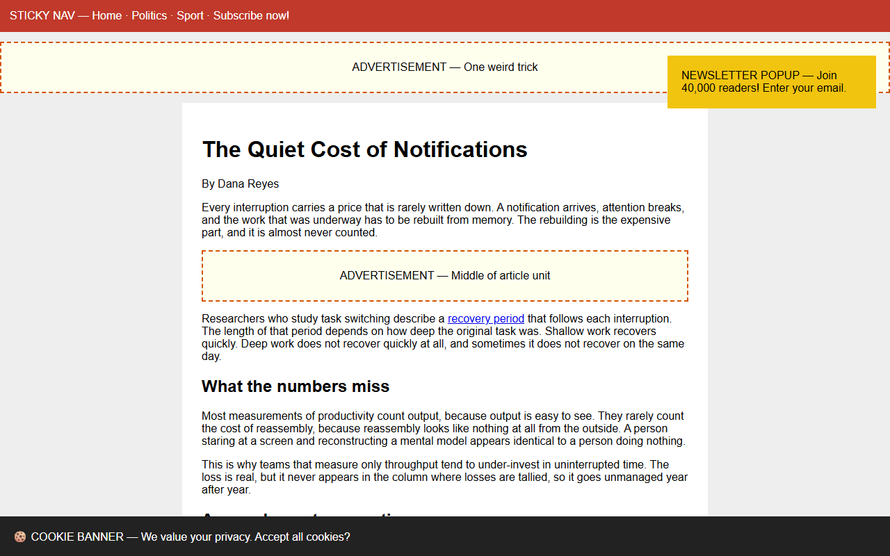
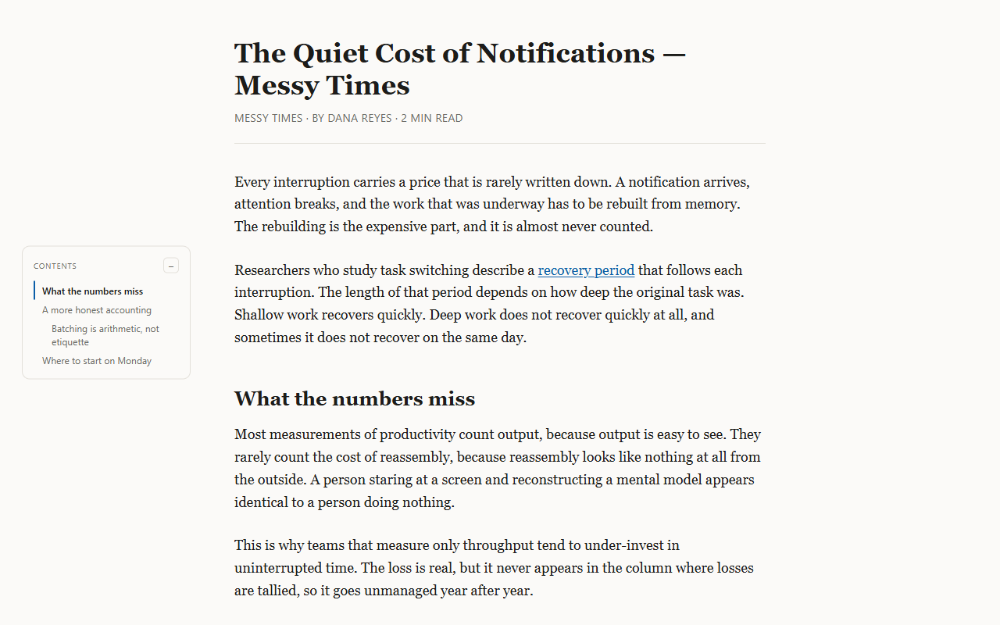
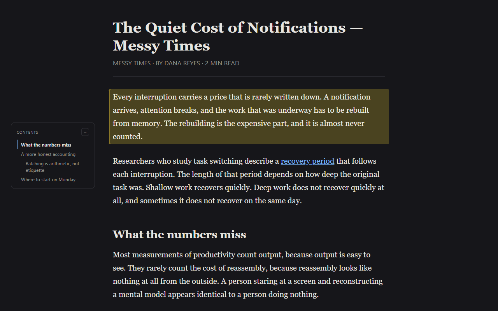
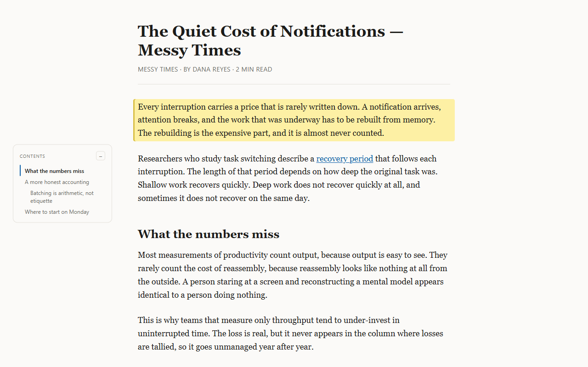
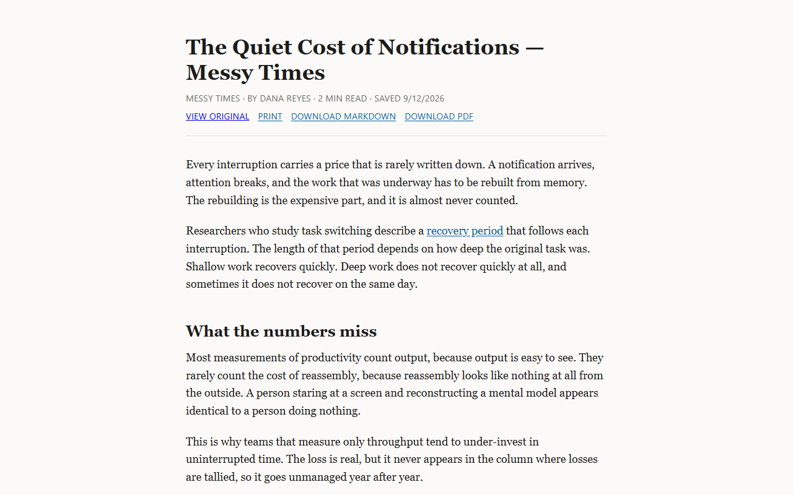
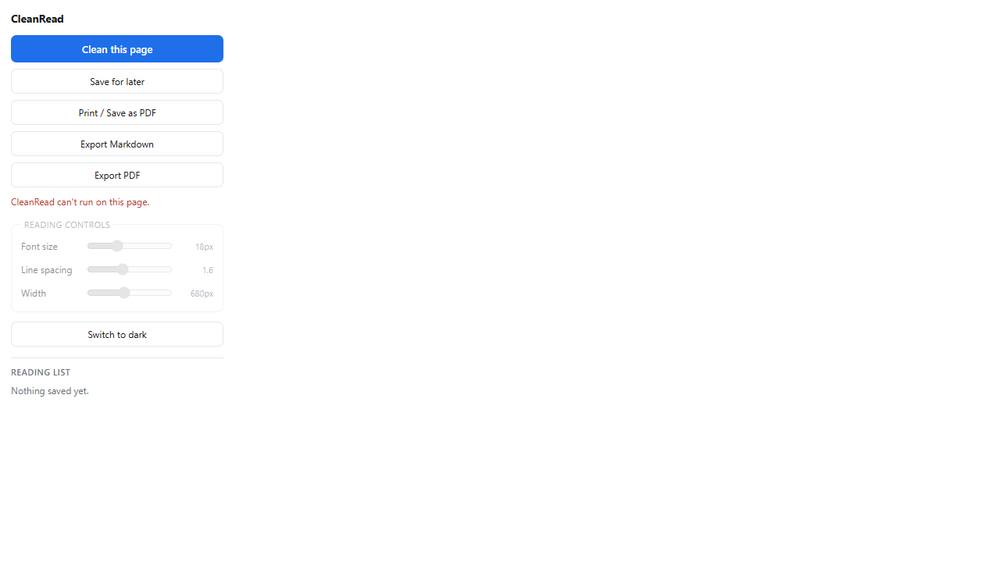

# CleanRead

**A Chrome extension that turns any cluttered article page into a clean, readable one.**


One click strips the ads, cookie banners, sticky menus and newsletter pop-ups, then lays
the article out as text you control — font size, line spacing, column width, light or dark.
Highlight what matters, save articles to read offline, and export to Markdown or PDF.

Nothing is collected. There is no account, no server and no analytics.

| Before | After |
|---|---|
|  |  |

---

## Features

| | |
|---|---|
| **Distraction removal** | Ads, cookie banners, newsletter pop-ups, sticky nav and share rails — judged by three independent signals, not one brittle blocklist |
| **Reading controls** | Font size, line spacing, column width, light/dark theme — applied live |
| **Table of contents** | Built from the article's own headings, with scroll-spy; hidden automatically when there are fewer than three |
| **Paragraph highlighting** | Click a paragraph to highlight it. Highlights are content-keyed, so they survive a page edit and a `#fragment` in the URL |
| **Reading list** | Save the cleaned article to IndexedDB and read it later, fully offline, in its own page |
| **Markdown export** | Turndown output, with equations exported as real LaTeX (`$…$`, `$$…$$`) rather than images |
| **PDF export** | Two paths: **Print** (browser-rendered, text stays selectable) and **Download PDF** (rasterised via html2pdf) |
| **Reading time** | Word-count estimate shown in the popup and the article header |

| Dark mode | Paragraph highlighting |
|---|---|
|  |  |
| **Saved, read offline** | **The popup** |
|  |  |

### Two problems worth calling out

Reader modes usually break on the same two things, so both are handled explicitly:

- **Equations stay readable.** Wikipedia and MathJax render maths as images. A naive
  reader forces every image to `display: block`, which drops inline maths onto its own
  centred line mid-sentence. CleanRead tags maths images, keeps inline maths inline, and
  inverts them in dark mode so black glyphs don't vanish on a dark background.
- **Charts and figures survive.** Lazy-loaded images, `<canvas>` charts and hero images
  wrapped in `class="...banner"` are all easy to lose — a cloned `<canvas>` is blank, and
  a naive junk filter deletes the hero along with the ad. See
  [`notes/features/media-preservation.md`](notes/features/media-preservation.md).

---

## Install

The extension is not on the Chrome Web Store yet. To run it from source:

```bash
git clone https://github.com/Safwan729-arch/cleanread.git
cd cleanread
npm install
npm run build
```

Then load it into Chrome:

1. Open `chrome://extensions`
2. Turn on **Developer mode** (top right)
3. Click **Load unpacked** and select the `dist/` folder
4. Pin CleanRead to the toolbar, open any article, and click the icon

`npm run package` produces a validated, store-ready zip in `release/`.

---

## Usage

| Action | Where |
|---|---|
| Clean the current page | **Clean this page** in the popup |
| Restore the original | **Restore original page** |
| Highlight a paragraph | Click it in the reading view; click again to remove |
| Save for later | **Save for later** — the article opens offline from the reading list |
| Export | **Export Markdown**, **Print / Save as PDF**, or **Export PDF** |

**Print is the better PDF.** It goes through Chrome's own renderer, so the text stays
selectable and searchable and the file is roughly ten times smaller. `Export PDF`
rasterises the page, which is occasionally what you want and usually is not.

---

## How it works

```
popup (React)  ──message──▶  content script  ──▶  Readability.js
     │                             │
     │                             ├─ scrub junk, preserve media, tag maths
     │                             └─ render into a shadow root
     │
     └──message──▶  service worker  ──▶  Dexie / IndexedDB
```

- **Extraction** is Mozilla's [Readability.js](https://github.com/mozilla/readability) —
  the same engine behind Firefox Reader View. Everything around it is ours: the junk
  scrub, the media preservation, the maths tagging.
- **The reading view is an overlay in a shadow root**, not a DOM rewrite. The host page is
  left intact, so *Restore* is exact and the page's CSS cannot bleed into the reader.
  ([why](notes/decisions/reader-overlay-vs-dom-rewrite.md))
- **The service worker owns IndexedDB.** Content scripts run in the *page's* origin, so
  they would write to the wrong database — they ask the worker instead.
- **All extension API calls go through `webextension-polyfill`** (`browser.*`, never
  `chrome.*`). Chrome is the only target today, but this keeps a future Firefox port cheap.
  ([what it would cost](notes/decisions/firefox-deferred.md))

### Stack

| Layer | Choice |
|---|---|
| Build | Vite 8 + [CRXJS](https://crxjs.dev/) |
| UI | React 19 (popup only — content scripts stay pure DOM) |
| Extraction | `@mozilla/readability` |
| Settings | `browser.storage.local` |
| Saved articles & highlights | IndexedDB via Dexie |
| Markdown | Turndown |
| PDF | `window.print()`, plus html2pdf.js for the rasterised path |

---

## Development

```bash
npm run dev            # Vite dev server with HMR
npm run build          # production build to dist/
npm run smoke:chrome   # 121 checks against the built extension in real Chrome
npm run package        # build, validate, and zip for the Web Store
npm run icons          # regenerate the icon set and the promo tile
npm run shots:store    # render 1280x800 listing screenshots
```

### Testing

There is no mocked DOM. `npm run smoke:chrome` loads the built extension into a real
Chrome instance and drives the actual message contract — 121 assertions covering
extraction, junk removal, the contents rail, highlighting, storage, both export paths,
maths rendering, media preservation, and recovery after an extension reload. It also
inspects the generated PDFs and the exported Markdown, because several real bugs passed
every green assertion and were only visible in the output.

Chrome 137 removed `--load-extension`, so the harness installs via the CDP
`Extensions.loadUnpacked` command. The four traps that make a load silently fail are
documented in [`notes/architecture/running-the-extension.md`](notes/architecture/running-the-extension.md).

### Conventions

- Always `browser.*` via `src/lib/browser.js` — never `chrome.` in `src/`
- Content scripts are pure DOM; React lives in the popup
- One Dexie schema (`src/lib/db.js`); content scripts never touch IndexedDB directly
- Entry files must have distinct filenames — two entries named `index.js` silently
  mis-wire the service worker ([how we found that](notes/decisions/entry-filenames-must-differ.md))

---

## Project structure

```
src/
  content-scripts/   clean.js — extraction, scrubbing, the reading view
  popup/             React popup UI
  reader/            offline page for a saved article
  background/        service worker; owns IndexedDB
  lib/               storage, exports, the polyfill wrapper
scripts/             build, packaging, icon and screenshot tooling
  fixtures/          deterministic HTML pages the smoke test runs against
notes/               engineering notes (Obsidian vault) — start at 00-index.md
manifest.json        Manifest V3, the single source of truth
```

### The `notes/` vault

`notes/` is an [Obsidian](https://obsidian.md/) vault holding the reasoning behind the
code: how each system works, why particular trade-offs were made, and the bugs worth
remembering. Start at [`notes/00-index.md`](notes/00-index.md). Some entry points:

- [Distraction removal](notes/features/distraction-removal.md) — the three signals, and the accepted risks
- [Media preservation](notes/features/media-preservation.md) — four ways article images go missing
- [Maths rendering](notes/features/math-rendering.md) — equations as images, kept inline and legible
- [Content script lifecycle](notes/architecture/content-script-lifecycle.md) — why updating an extension orphans open tabs
- [Shadow DOM isolation](notes/decisions/shadow-dom-isolation.md) — why the reader lives in a shadow root

---

## Permissions and privacy

| Permission | Why |
|---|---|
| `storage` | Reading preferences (theme, font size, spacing, width) |
| `activeTab` | The popup reads the current tab's URL to tell whether it is already saved |
| `scripting` + host access to `http`/`https` | Re-inserts the extension's own content script into tabs that were already open when the extension updated, so you don't have to reload them. The same pages the content script already matches |

Content scripts match `http://*/*` and `https://*/*` rather than `<all_urls>`, and there is
no remote code — every dependency is bundled.

**No data leaves your machine.** Articles, highlights and settings live in
`storage.local` and IndexedDB on your own device. There is no server, no analytics, and no
network request the extension makes on its own. Full text: [PRIVACY.md](PRIVACY.md).

---

## Known limitations

- **CSP.** A small share of sites block content script injection or style changes outright.
  This is expected and cannot be worked around from inside an extension.
- **Restricted pages.** `chrome://`, `about:`, the Chrome Web Store and the built-in PDF
  viewer bar content scripts, so CleanRead cannot run there.
- **`Download PDF` rasterises.** The text in that file is an image. Use **Print** when you
  want selectable text; it is also far smaller.
- **`minimum_chrome_version: 116`** is enforced by `build.target: 'chrome116'`, so the
  emitted *syntax* really does compile to that floor. That bounds syntax, not runtime
  behaviour — the extension has so far only been *run* on current Chrome.
- **Not yet on the Chrome Web Store.** The package is built and validated; publishing is
  the remaining step.

## Roadmap

- Publish to the Chrome Web Store
- Firefox support — deliberately deferred, not abandoned; the source stays
  browser-agnostic and [the cost is written down](notes/decisions/firefox-deferred.md)
